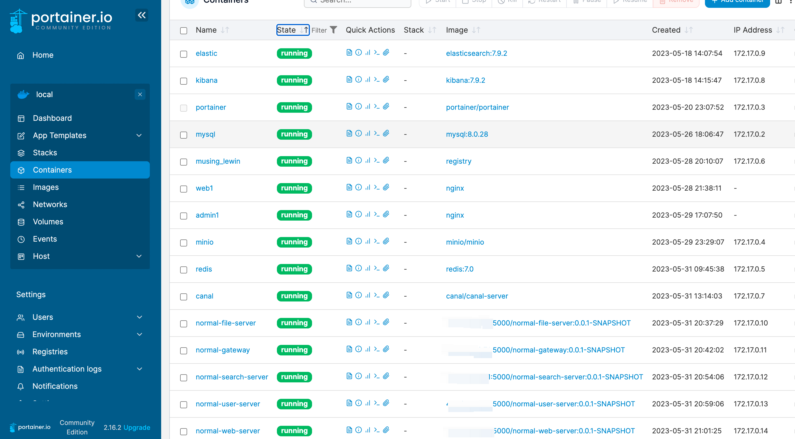
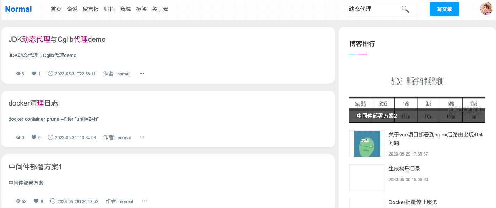

# normal-blog

```text
分层逻辑：
一般访问量大或者数据量大或者业务量大的的服务单独分层、例如秒杀、
为了某个功能宕机不影响主业务，则该功能也要拆分成微服务，例如排行榜

1. 业务功能模块分层 + 基础服务分层(search + rbac + file + web + admin)
├── normal-admin
├── normal-base
|  ├── normal-base-api
|  ├── normal-base-server
├── normal-common
|  ├── normal-common-const
|  ├── normal-common-core
|  ├── normal-common-security
|  ├── normal-common-util
|  └── pom.xml
├── normal-file
|  ├── normal-file-api
|  ├── normal-file-server
├── normal-framework
|  ├── normal-spring-boot-starter-minio
|  ├── normal-spring-boot-starter-monitor
├── normal-gateway
├── normal-pay
|  ├── normal-pay-api
|  ├── normal-pay-server
├── normal-rbac
|  ├── normal-rbac-api
|  ├── normal-rbac-server
├── normal-search
|  ├── normal-search-api
|  ├── normal-search-server
├── normal-user
|  ├── normal-user-api
|  ├── normal-user-server
├── normal-web
|  ├── normal-web-api
|  ├── normal-web-server
```
具体分层可以参考

阿里巴巴[Java开发手册黄山版](https://github.com/alibaba/p3c/blob/master/Java%E5%BC%80%E5%8F%91%E6%89%8B%E5%86%8C(%E9%BB%84%E5%B1%B1%E7%89%88).pdf)第六章第一节

[mall4cloud](https://gitee.com/gz-yami/mall4cloud/blob/master/doc/%E4%BB%A3%E7%A0%81%E7%9B%AE%E5%BD%95%E7%BB%93%E6%9E%84/mall4cloud%E7%9B%AE%E5%BD%95%E7%BB%93%E6%9E%84.md)

### 技术栈

#### 后端

| 组件                        | 功能 |
|---------------------------|----|
| springboot                | 后台框架 |
| SpringCloud               | 微服务组件 |
| MybatisPlus               | ORM框架 |
| SpringSecurity + OAuth2.0 | 认证授权 |
| MinIO                     | 文件服务 |
| Elasticsearch             | 搜索 |
| Sentinel                  | 限流 |
| SpringCloud Gateway       | 网关 |
| Hutool                    | 常用工具 |
| Redis                     | 缓存 |
| MySQL                     | 数据库 |
| RocketMQ                  | 消息队列 |
| Canal                     | 数据同步 |

#### 前端

| 组件               | 功能         |
|------------------|------------|
| axios            | http请求     |
| markdown-it      | markdown渲染 |
| avatar-cropper   | 头像剪裁       |
| image-conversion | 图片压缩       |

后台功能
1. 博客管理
    - [x] 门户管理
2. 说说管理
   - [x] 说说列表
   - [x] 发布
2. 系统管理
    - [x] 用户管理
    - [x] 角色管理
    - [x] 菜单管理
    - [ ] 错误码管理
4. 消息管理
   - [ ] 通告
   - [ ] 邮箱管理
5. 监控中心
   - [ ] 服务器监控
   - [ ] MySQL监控
   - [ ] 服务监控
前台功能
- [x] 登录、注册
- [x] Elasticsearch高亮搜索
- [x] 博客列表、详情、修改、删除
- [x] 动态门户菜单
- [x] 博客排行
- [x] 说说
- [x] 留言板(样式待调整)
- [x] skywalking
- [x] feed流分页，实现滚动分页，两个参数lastViewId, pageSize
    - 通过`zrevrangebyscore`实现通过分数分页，`zrevrangebyscore key timestamp 0 `
- [x] 归档
- [x] 标签

### 功能界面




TODO
- [ ] 签到
- [ ] rocketmq集成
- [ ] canal 同步es
- [ ] 支付集成支付宝当面付
- [ ] 商品管理
- [ ] 商城
